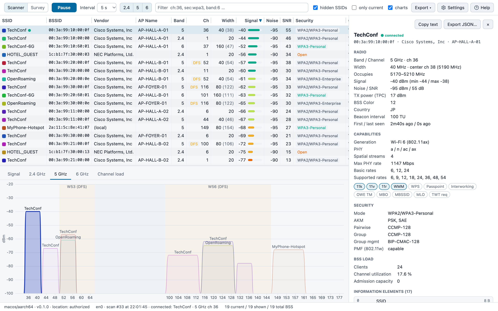

# WiFiSight

[English](README.md) | 日本語

WiFiSight は、イベント NOC のための Wi-Fi スキャナです。
会場の事前サーベイから設営後の検証、会期中の監視までを 1 つのツールでこなせます。

## 特長

### BSSID ではなく AP 名で見える

AP がビーコンで通知している AP 名を、一覧にそのまま表示します。
「この BSSID はどの AP か」を管理画面と突き合わせる必要がなく、電波の弱い AP や不調な AP をその場で特定できます。
多くの業務用 AP ベンダーの形式に対応しています。

> [!NOTE]
> AP 名はコントローラや AP 側で通知を有効にしたときだけビーコンに載ります。Aruba の `advertise-ap-name` に相当する設定を、SSID ごとに有効にしてください。

### 外部 Probe に計測を任せられる

Raspberry Pi やミニ PC で `wifisight-cli serve` を動かせば、計測をそのデバイスに任せられます。
Probe を会場の離れた場所に置けば、LAN 越しにその場所の電波をリモートで監視できます。

手元の補助デバイスとして使うこともできます。
Wi-Fi 接続中の PC で計測すると、OS がスキャンを間引くため、安定して計測できません。
Probe はどこにも接続せず計測だけに使うので、毎回同じ条件で計測でき、PC はインターネットにつないだまま作業できます。
詳しくは [docs/probe.md](docs/probe.md) を参照してください。

### どの OS でも同じ解析結果

macOS、Windows、Linux で動き、解析は共通の `wifi-core` が行うので、どの環境でも同じ結果を表示します。



## 機能

- **Scanner**：周囲の BSS を一覧表示します。SSID、BSSID、ベンダー、AP 名、チャネルと幅、RSSI、Noise、SNR、セキュリティ、PHY、NSS、最大 PHY レート、接続クライアント数、チャネル使用率、11k/v/r、国コードを確認できます。信号強度の推移、2.4/5/6 GHz のスペクトラム、チャネルごとの混雑度、全 IE のデコード結果も表示します
- **Survey**：図面の上で現在地をクリックして計測すると、ヒートマップと AP の推定位置を描きます。結果は `*.survey.json` に保存されます
- **外部 Probe**：別のデバイスで計測します。手順は [docs/probe.md](docs/probe.md) を参照してください
- **CLI**：GUI と同じ解析結果を、表、JSON、JSONL ログで出力します
- **エクスポート**：CSV と JSON に書き出せます

一覧は `ch:36, sec:wpa3, band:6` のような書き方で絞り込めます。
アプリ内で `?` を押すと、フィルタの構文とキーボードショートカットの一覧が出ます。

## インストール

[Releases](https://github.com/tsuyopon123/wifisight/releases) から環境に合ったファイルをダウンロードしてください。

| OS | ファイル |
|---|---|
| macOS 11 以降（Apple Silicon、Intel） | `.dmg` |
| Windows 10/11（x64） | `-setup.exe`。インストールせずに使うなら `-portable.exe`（WebView2 が必要。Windows 11 には標準で入っています） |
| Linux（x64、arm64） | `.deb` |

### 初回起動

コード署名をしていないため、初回起動時に警告が出ます。

- **macOS**：`.dmg` からアプリケーションフォルダにコピーして起動します。起動できないときは、システム設定 › プライバシーとセキュリティ で「このまま開く」を押してください
- **Windows**：SmartScreen の画面で「詳細情報」→「実行」を選びます
- **Linux**：`sudo apt install ./<ファイル名>.deb` でインストールします

### アップデート

起動時に新しいリリースを確認し、あればステータスバーの版の隣に「vX available」と表示します。勝手に更新はしません。
更新するには、設定 › Updates の「Check for updates」を押します。ダウンロードとインストールのあと、アプリを再起動します（Linux では `.deb` のインストールにパスワードを求められます）。
起動時の確認が不要なら、同じ場所の「Check on launch」をオフにしてください。
通常は正式版（`-release.N`）だけを対象にします。beta も受け取るなら、同じ場所の「Include beta releases」をオンにしてください。`-portable.exe` では更新せずに Releases ページを開きます。

### 権限

スキャン結果を取得するには、次の権限が必要です。

| OS | 必要な権限 |
|---|---|
| macOS | 位置情報サービス。許可しないと SSID と BSSID が取得できません。初回起動時に許可を求められます。なお、CLI 単体では BSSID を取得できません |
| Windows | Windows 11 24H2 以降は、設定 › プライバシーとセキュリティ › 位置情報 で「デスクトップ アプリに位置情報へのアクセスを許可する」をオンにします |
| Linux | スキャンの開始に `CAP_NET_ADMIN` が必要です。`.deb` はインストール時に自動で付与します（失敗したときは `sudo setcap cap_net_admin+ep /usr/bin/wifisight` を実行してください）。権限がないときは `nmcli` 経由で再スキャンを試み、それも失敗するとキャッシュ済みの結果を表示します |

## CLI

`wifisight-cli` は、同じリリースページに別ファイルとして置いています。
`linux-x86_64`、`linux-aarch64`（Raspberry Pi など）、`macos-universal`、`windows-x86_64` 向けがあります。
`.tar.gz` を展開し（Windows 版は `.exe` のまま）、`PATH` の通った場所に置いてください。

```sh
tar -xzf wifisight-cli-<バージョン>-linux-aarch64.tar.gz
sudo mv wifisight-cli /usr/local/bin/
```

Rust（stable）があれば、ソースからもインストールできます。

```sh
cargo install --git https://github.com/tsuyopon123/wifisight wifi-cli
```

主なコマンド：

```sh
wifisight-cli interfaces
wifisight-cli scan                # 表で表示
wifisight-cli scan --json         # 解析済みの JSON
wifisight-cli scan --raw          # OS から取得した生データ（IE は hex）
wifisight-cli watch --interval 5 -o survey.jsonl
wifisight-cli serve               # 外部 Probe として :8737 で待ち受け
```

`--raw` の出力は、不具合報告や `wifi-core` のテストデータに使えます。

Linux で外部 Probe にするなら、同じページの `wifisight-probe_<バージョン>_<amd64|arm64>.deb` を入れると、CLI と、起動時に `serve` を動かす systemd のサービスが入ります。詳しくは [docs/probe.md](docs/probe.md) を見てください。

## 開発

### ビルド

Rust（stable）と Node.js 22.18 以降（自己チェック用の `.ts` を直接実行するため）が必要です。
Linux では次のパッケージも入れてください。

```sh
sudo apt install libwebkit2gtk-4.1-dev libgtk-3-dev librsvg2-dev libayatana-appindicator3-dev
```

```sh
npm install
npm run tauri dev     # 開発モードで起動
npm run tauri build   # 配布用バンドルを作成（.app/.dmg、-setup.exe、.deb）
cargo run -p wifi-cli -- scan   # CLI を実行
```

`npm run tauri build` はアプリ内アップデート用のファイルにも署名します。そのため `TAURI_SIGNING_PRIVATE_KEY`（と `TAURI_SIGNING_PRIVATE_KEY_PASSWORD`）を設定していないと、「A public key has been found, but no private key」で失敗します。
鍵がない場合は、それらのファイルを作らずにビルドしてください：`npm run tauri build -- --config '{"bundle":{"createUpdaterArtifacts":false}}'`

macOS の位置情報の権限は `.app` ごとに付与されるため、`npm run tauri dev` ではターミナルに付与されることがあります。
確実に試すなら、`npm run tauri build -- --debug` で作った `.app` を起動してください。

`npm run dev` で http://localhost:1420 を開くと、UI だけを確認できます。
ブラウザからはスキャンできないので、スキャン結果の欄はエラー表示になります。

`THIRD_PARTY_LICENSES.html` はアプリに同梱され、CI がビルドのたびに再生成します。
依存を変えたあとにローカルでも更新するなら、`cargo about generate about.hbs -o THIRD_PARTY_LICENSES.html` を実行してください（`cargo install cargo-about --locked --features cli` で入ります）。

### 構成

各 OS 向けのスキャナは生の BSS 情報と IE を集めるだけで、解析はすべて共通の `wifi-core` が行います。

| パス | 内容 |
|---|---|
| `crates/wifi-core` | IE の解析（OS 非依存） |
| `crates/wifi-scan` | OS 別のスキャナ（macOS は CoreWLAN、Windows は Native Wifi API、Linux は nl80211） |
| `crates/wifi-cli` | CLI（`wifisight-cli`） |
| `src-tauri` | Tauri のバックエンド |
| `src` | UI（TypeScript、Canvas） |

### テスト

```sh
cargo test -p wifi-core -p wifi-scan -p wifi-cli
node src/heatmap.check.ts    # ヒートマップ計算の自己チェック
```

GitHub Actions が macOS、Windows、Ubuntu でテストを実行し、CLI と GUI のバンドルを作ります。
`v*` タグを push すると、バンドルを添付したドラフトのリリースが作られます。

## ライセンス

[MIT](LICENSE)
